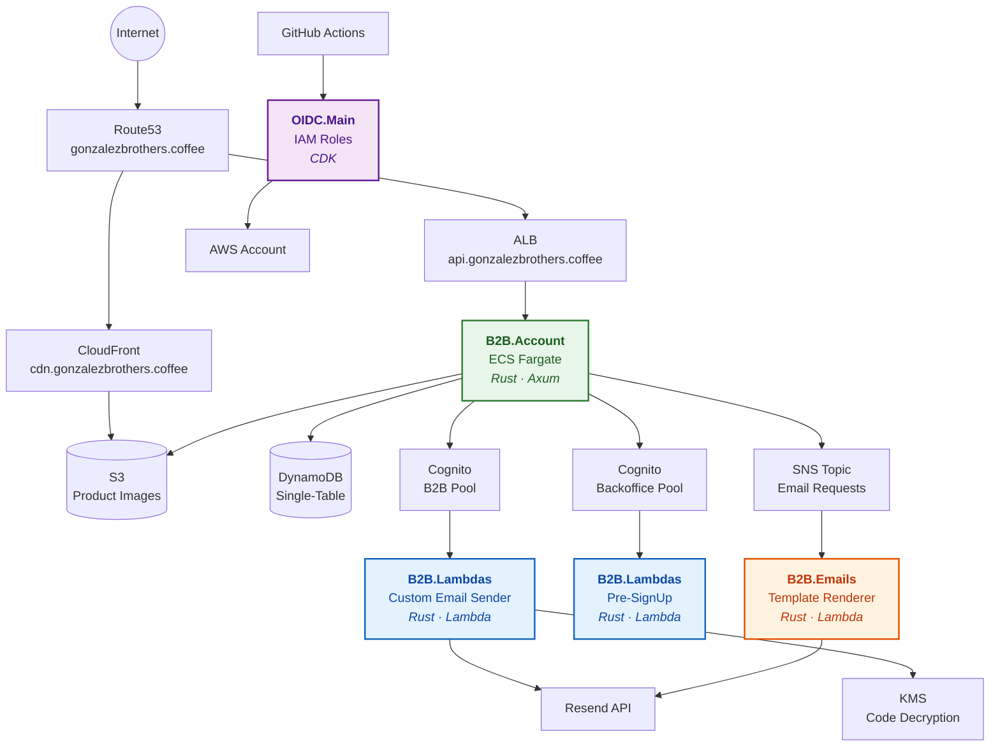

# Gonzalez Brothers

B2B specialty coffee platform — connecting roasters with single-origin lots from Latin American producers.

## System Architecture

## Repositories

| Repo | Stack | Purpose |
|------|-------|---------|
| [**B2B.Account**](https://github.com/gonzalez-brothers/B2B.Account) | Rust, Axum, DynamoDB, Askama | Main backend — API, backoffice, auth, orders, catalog. Deployed on ECS Fargate |
| [**B2B.Lambdas**](https://github.com/gonzalez-brothers/B2B.Lambdas) | Rust, Lambda, KMS | Cognito triggers — email domain restriction (pre-signup) and branded email sending (custom email sender via Resend) |
| [**B2B.Emails**](https://github.com/gonzalez-brothers/B2B.Emails) | Rust, Lambda, SNS | Transactional email service — receives requests via SNS, renders templates, sends via Resend |
| [**OIDC.Main**](https://github.com/gonzalez-brothers/OIDC.Main) | CDK, IAM | Centralized GitHub OIDC provider and per-repo IAM roles for CI/CD |

## How It Fits Together

**B2B.Account** is the core service. It handles the coffee catalog, customer accounts, orders, and the admin backoffice. It authenticates B2B customers and backoffice users via two separate **Cognito** user pools.

**B2B.Lambdas** deploys the Cognito Lambda triggers that B2B.Account's user pools reference. The pre-signup trigger restricts backoffice signups to `@gonzalezbrothers.coffee`. The custom email sender decrypts Cognito verification codes (via KMS) and sends branded emails through Resend. These are independently deployed and connected via SSM Parameter Store ARNs.

**B2B.Emails** handles all transactional emails (welcome, order confirmation, shipping, account deletion). B2B.Account publishes to an SNS topic, and B2B.Emails subscribes — rendering embedded templates and sending via Resend. Fire-and-forget, fully async.

**OIDC.Main** manages the AWS IAM roles that all repos use for CI/CD. Each repo gets a least-privilege role assumed via GitHub OIDC — no long-lived AWS credentials.

## Infrastructure

| Component | Service | Region |
|-----------|---------|--------|
| API | ECS Fargate (0.25 vCPU, 512 MB) | eu-west-2 |
| Database | DynamoDB (single-table design) | eu-west-2 |
| Auth | Cognito (B2B + Backoffice pools) | eu-west-2 |
| CDN | CloudFront + S3 | Global / eu-west-2 |
| Email | SNS + Lambda + Resend | eu-west-2 |
| DNS | Route53 | Global |
| CI/CD | GitHub Actions + OIDC | — |
| IaC | AWS CDK (TypeScript) | — |

All infrastructure is defined as code via CDK, deployed through GitHub Actions, and authenticated via OIDC — no manual AWS console changes.
